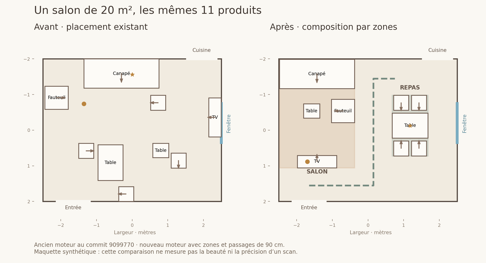

# Composition et plan de zones — 11 octobre 2026

RealRoom compose désormais des ensembles avant de placer les meubles : salon, repas, lecture, sommeil, travail et rangement. Le changement est partagé par les deux expériences, RealRoom et Maison Corleone, ainsi que par la démo IA et la simulation locale.

## Architecture

`lib/programme.js` calcule la surface du vrai contour et définit un inventaire par usages pour les sept types du protocole. Les paliers décident des quantités, de l’éclairage et des compléments. Le catalogue remplit ces emplacements ; les alternatives budgétaires doivent conserver leur usage, leur capacité de repas et, pour un lit, le contrat de chevets intégrés.

L’appel IA existant reçoit ce programme. Il renvoie `planVie` : types de zones, priorités et raisons, sans coordonnées. Les priorités sont bornées côté serveur. Les exclusions du client prévalent sur les suggestions. Aucun nouvel appel payant ni entraînement n’est ajouté.

`lib/zonage.js` construit des patrons de groupes à partir des dimensions réelles : canapé/table/fauteuil/meuble TV, table/chaises/suspension, lit/chevets, fauteuil/table/lumière de lecture, bureau/siège/lampe, bain/vasque et accueil. Il essaie plusieurs translations, orientations et versions allégées dans le polygone. Au plus 72 candidats par groupe et 64 états intermédiaires sont retenus. Les fenêtres, accès cuisine explicitement renseignés et distance aux portes orientent le choix. Les sorties de sol, collisions et emprises de portes sont éliminées avant le score esthétique.

Les accès protégés comprennent 60 cm sur les côtés du lit, 65 cm au pied, 75 cm derrière les chaises de repas, 80 cm au poste de travail et devant les rangements. Les chemins entre ensembles gardent la cible existante de 90 cm. Une grille de coordonnées critiques contrôle précisément les passages étroits : le test accepte 92 cm et refuse 86 cm, avec la même cible de 90 cm. Les liens de cette grille vérifient leur corridor complet dans le polygone, pas seulement leurs extrémités.

Le solveur micro conserve ses contrôles. Il reçoit `planZones` et refuse les mouvements qui sortiraient un meuble de son ensemble. Les relations canapé/table, conversation et éclairage sont limitées à la même zone : un fauteuil de lecture n’est plus attiré vers le canapé. Les éléments conservés et les installations restent immobiles. Les objets posés suivent leur support ; les lampes de table sont réellement posées sur une table ou un meuble bas.

Si les accès restent insuffisants, la recherche enlève des compléments de faible priorité, puis un ensemble secondaire si nécessaire, avec au plus six reprises. Les retraits apparaissent dans le diagnostic et les besoins non satisfaits restent visibles. Le réaménagement partiel et le drapeau de repli conservent leur comportement.

## Adaptations critiques du protocole

Les emprises « 3 × 3 m » ou « 2,5 × 2,5 m » sont des repères. Le contrôle porte sur les vrais meubles et leurs dégagements ; imposer toutes ces dimensions comme des rectangles fixes rendrait certains scénarios de 20 m² impossibles.

La règle « jamais sous la composition de base, quel que soit le budget » ne peut pas être garantie. Le budget reste un plafond ; le logiciel explique les besoins incomplets plutôt que de dépasser la somme ou d’inventer des produits. Une table de quatre places ne remplace pas automatiquement une table de six places tout en conservant six chaises.

Le catalogue actuel manque notamment de chaises de repas adultes identifiées et de plusieurs usages spécialisés. Un tabouret enfant n’est pas proposé comme chaise adulte. L’ensemble Dining Contemporaine possède deux chaises dans sa description, mais ses dimensions renseignées décrivent seulement la table : il n’est pas placé automatiquement comme si tout l’ensemble tenait dans un carré de 70 cm. Les dimensions globales devront être renseignées pour l’utiliser automatiquement.

La baignoire îlot n’est proposée qu’à partir de 10 m², avec son dégagement réel de 60 cm. En dessous, seul un modèle documenté pour pose murale convient ; l’absence d’un tel produit est signalée. Les contraintes de plomberie restent toujours affichées. La diagonale d’un écran, un accès cuisine, une main dominante ou une installation technique inconnue ne sont pas inventés.

Les règles sont une adaptation RealRoom des travaux déjà référencés dans `DECISIONS.md` (Merrell/Stanford, Yu/UCLA), pas des coefficients officiels du MIT ni une certification d’accessibilité.

## Résultats mesurés

Les deux références passent dans le pipeline complet : chambre 3,50 × 4 m avec les cinq meubles et deux chevets ; salon 5 × 4 m avec les onze éléments, dont quatre chaises, aucune collision, TV hors axe de la fenêtre, repas côté fenêtre/cuisine et chemins séparés. Les accès micro passent aussi.

| Banc synthétique | Cas | Sans conflit géométrique | Plan partiel ou total admissible | Programme obligatoire complet |
|---|---:|---:|---:|---:|
| Chambres, 9–20 m², rectangles/L/oblique/décroché | 10 | 10/10 | 9/10 (90 %) | 5/10 (50 %) |
| Salons, 12–56 m², mêmes variations | 13 | 13/13 | 10/13 (77 %) | 6/13 (46 %) |

Un plan partiel admissible peut manquer d’un lit, d’un coin repas ou d’un rangement : ce n’est pas une composition réussie. Les besoins manquants et les cas à vérifier sont conservés dans les logs. Les configurations les plus petites restent limitées par les dimensions des produits. Aucune réussite à 100 % n’est revendiquée.

Les sept programmes sont également testés à 4, 8, 14 et 30 m² : 28 inventaires, avec vérification des usages, quantités et garde-fous. Ce contrôle des inventaires ne constitue pas une validation de toutes les installations techniques.

Le grand DXF client a été exercé localement avec le vrai catalogue, sans appel IA payant. Le contour et les ouvertures restent intacts ; la composition obtient des ensembles salon/repas/lecture/rangement. Les chaises manquantes sont signalées. Les mesures locales sont de l’ordre de cinq secondes pour cette recherche ; elles ne garantissent pas le temps de réponse du fournisseur ou d’un téléphone. Le fichier client et ses coordonnées ne sont pas versionnés.

Validation : **154 tests unitaires réussis**, build Next réussi et **12 scénarios API réussis** avec le DXF privé et le fournisseur de test. Le premier essai API sur le port précédent a rencontré des compteurs déjà utilisés ; le passage isolé sur le port 3217 réussit. Le journal du fournisseur confirme trois appels de test, sans service payant.

La comparaison métrique a été inspectée visuellement. Aucune nouvelle session navigateur complète ni capture AR réelle n’a été exécutée pour cette modification. L’accès Vercel du connecteur reste insuffisant pour inspecter les fonctions en ligne ; le statut du déploiement est vérifié via GitHub.

## Vérification et comparaison

`docs/plan-zones/resultats.json` contient les résultats, positions et diagnostics synthétiques. `execution.log` conserve la sortie réelle du banc. Les fichiers `avant.json` et `apres.json` donnent le même salon et les mêmes onze produits : ancien moteur au commit `9099770`, puis nouveau moteur. Les notes sont des diagnostics d’usage, pas des notes de beauté.



Reproduction :

```sh
npm test
npm run build
PORT=3217 node tests/api.mjs
node scripts/valider-zones.mjs
python3 scripts/illustrer-zones.py
```

Pour régénérer aussi l’ancien placement, créer un worktree détaché du commit `9099770`, puis passer son chemin dans `BASELINE_ZONES` au script de validation. `DXF_REGRESSION` accepte le chemin local d’un plan privé pour les essais API ; aucun fichier client n’est requis dans le dépôt.

## Interface et diffusion

Sous le concept, une ligne affiche les ensembles retenus. « Ensembles à compléter » et « Circulation à vérifier » ne développent leurs explications qu’à la demande. La maquette, les boutons d’ajout et de réaménagement restent utilisables. Les anciennes propositions sans plan de zones continuent à s’afficher ; il faut relancer l’aménagement pour appliquer cette composition.

Publication sur la branche de démo existante et la PR #2, sans fusion ni promotion en production. Aucun réglage de clés, quota, débit de crédits ou modèle d’image n’est modifié par ce changement.
